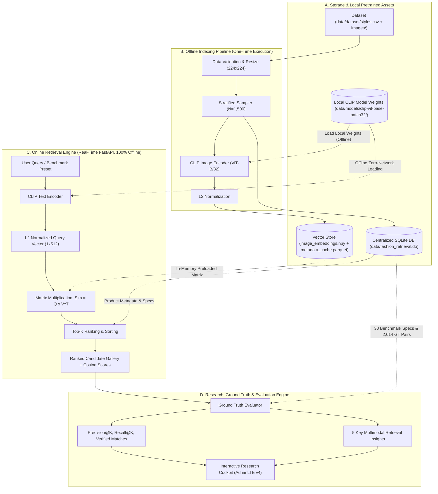

# System Analysis & Design Blueprint: Attribute-Based Text-to-Image Retrieval for Fashion Products

This document serves as the comprehensive technical specification and architectural analysis for **Attribute-Based Text-to-Image Retrieval for Fashion Products** within the scope of *Multimodal Information Retrieval*.

---

## 1. Research Context, Objectives, and Scope

### 1.1 Background & Problem Statement
In conventional fashion e-commerce platforms, lexical text-based search (e.g., BM25 or inverted-index TF-IDF) relies strictly on the accuracy and exhaustiveness of textual metadata (tags, titles, descriptions). This paradigm presents fundamental limitations:
1. **Vocabulary Mismatch**: Users frequently search using visual synonyms (e.g., *"navy sneakers"*, *"casual summer dress"*), while database records may label items as *"blue sports footwear"*.
2. **Semantic Gap**: Sparse lexical representations cannot comprehend continuous visual features directly from product images (fabric texture, garment silhouette, color grading, decorative patterns).
3. **Ranking-Centric Retrieval Requirements**: Rather than performing simple single-label classification (*"is this image a dress or not?"*), the system must compute a ranked candidate list (*Top-K ranking*) across thousands of items ordered by compound multi-attribute relevance (*articleType*, *baseColour*, *gender*, and *usage*).

### 1.2 Research Questions (RQs)
* **RQ1 (Attribute Sensitivity)**: How accurately can specific textual attributes (*baseColour*, *articleType*, *gender*, and *usage*) be mapped to visual image representations using a zero-shot CLIP model?
* **RQ2 (Ambiguity vs. Precision)**: How does increasing query specificity (from 1-token general/ambiguous queries, 2-token medium queries, to 3–4 attribute compound queries) impact Precision@K and overall ranking quality?
* **RQ3 (Representation Space Efficiency)**: What is the computational latency and memory trade-off of precomputed in-memory embedding lookups versus real-time multi-attribute filtering on a corpus of 1,500 fashion products?

---

## 2. Dataset Preparation & Exploratory Data Analysis (EDA)

### 2.1 Data Source & Properties
* **Source**: *Fashion Product Images Dataset (Kaggle - Param Aggarwal)*.
* **Metadata Schema**: `id`, `gender`, `masterCategory`, `subCategory`, `articleType`, `baseColour`, `season`, `year`, `usage`, `productDisplayName`.
* **Image Association**: Each metadata row corresponds directly to a JPEG image file at `images/{id}.jpg`.

### 2.2 Data Validation & Cleaning Pipeline
Prior to sampling and indexing, an automated data integrity validation pipeline executes four validation passes:
1. **Integrity Check**: Verifies image file presence on disk and file decodability (detecting corrupted files using Pillow).
2. **Missing Attribute Sanitization**: Filters out rows with `null`/`NaN` in crucial columns: `articleType`, `baseColour`, `gender`, and `usage`.
3. **Duplicate Detection**: Identifies and drops duplicate product IDs to guarantee 1-to-1 mapping.
4. **Attribute Normalization**: Standardizes textual strings (trimming whitespace, uniform casing).

```
   Raw Dataset CSV (44,446 rows) + Images Directory (44,424 valid files)
                                  │
                                  ▼
        [ Data Integrity Filter ] ──── 22 Missing / Corrupt Images Dropped
                                  │
                                  ▼
      [ Missing & Duplicate Cleaner ] ── 379 Missing Essential Attribute Rows Dropped
                                  │
                                  ▼
         [ Clean Valid Corpus ] (44,045 clean records)
                                  │
                                  ▼
      [ 12 Target Article Types Filter ] ── 28,662 Non-Target Category Records Dropped
                                  │
                                  ▼
       [ Eligible Evaluation Pool ] (15,383 candidate records)
                                  │
                                  ▼
     [ Stratified Subset Sampler ] ── Fixed Seed = 42 Proportional Allocation
                                  │
                   ┌──────────────┴──────────────┐
                   ▼                             ▼
       [ 500-Item EDA Subset ]       [ 1,500-Item Evaluation Corpus ]
     (subset_500_eda.csv)           (subset_1500_eval.csv)
```

### 2.3 Reproducible Subset Sampling Strategy
To ensure computational reproducibility while maintaining statistically rigorous evaluation cohorts:
* **Phase A (Prototyping & EDA Subset)**: $N = 500$ products.
* **Phase B (Evaluation & Retrieval Corpus)**: $N = 1,500$ products (including exhaustive ground-truth candidates + balanced distractors).
* **12 Target Article Types (`articleType`)**:
  Selected high-variance fashion article categories:
  1. `Tshirts` (445 items, 29.7% — Casual topwear)
  2. `Shirts` (197 items, 13.1% — Formal/casual collared topwear)
  3. `Casual Shoes` (191 items, 12.7% — Daily footwear)
  4. `Watches` (146 items, 9.7% — Wrist accessories)
  5. `Sports Shoes` (139 items, 9.3% — Athletic footwear)
  6. `Handbags` (111 items, 7.4% — Bags and carriers)
  7. `Sunglasses` (70 items, 4.7% — Eyewear accessories)
  8. `Backpacks` (54 items, 3.6% — Utility bags)
  9. `Formal Shoes` (43 items, 2.9% — Leather/dress footwear)
  10. `Jeans` (27 items, 1.8% — Denim bottomwear)
  11. `Jackets` (22 items, 1.5% — Outerwear)
  12. `Caps` (21 items, 1.4% — Headwear)
* **Stratification Criteria**: Proportional stratified allocation based on `(articleType, gender)` tuple distribution with fixed `random_seed = 42`.
* **Persistence**: Serialized to `data/processed/subset_500_eda.csv`, `data/processed/subset_1500_eval.csv`, and synchronized with the centralized SQLite database (`data/fashion_retrieval.db`).

### 2.4 EDA Framework & 5 Key Multimodal Retrieval Insights

| # | Topic | Observation | Retrieval Implication | Action / Solution |
| :-: | :--- | :--- | :--- | :--- |
| **1** | **Dominance of Topwear & Footwear** | Tshirts (29.7%), Shirts (13.1%), and Shoes (23.9%) comprise >66% of the catalog. Long-tail items like Caps (1.4%) and Jackets (1.5%) have sparse representation. | Broad queries without category constraint risk overflowing Top-K with dominant categories (*category bias*). | Stratified sampling ensures niche categories have sufficient representation for zero-shot testing. |
| **2** | **Color Distribution & Bleed** | Neutral tones (Black, White, Blue, Grey) represent >68% of the corpus. Saturated colors (Red, Maroon, Green) represent <15%. | CLIP excels at high-contrast colors, but background elements or model garments can cause *color bleed* into item ratings. | Isolated product shots reduce noise; multi-attribute ground truth penalizes color bleed. |
| **3** | **Ghost Mannequin Gender Bias** | Footwear, watches, and bags are photographed without models (*ghost mannequin* style), lacking overt visual gender markers. | Queries with gender modifiers (e.g., *"men watches"*) rely on subtle styling cues; zero-shot CLIP often retrieves unisex items. | Ground truth incorporates unisex allowances where visual gender separation is impossible. |
| **4** | **Subcategory Boundary Granularity** | Visual boundaries between Casual Shoes vs Sports Shoes, or Shirts vs Tshirts, show subtle silhouette transitions. | Minor semantic overlaps can produce apparent false positives that are aesthetically valid. | Compound benchmark queries combine color, usage, and gender to test fine-grained boundary separation. |
| **5** | **Zero-Shot Semantic Gap in Usage** | The `usage` attribute (*Casual*, *Formal*, *Sports*) is an abstract functional concept rather than a concrete visual pattern. | CLIP correlates formal usage with leather textures, dark tones, and collared cuts, but borderline casual-formal items are ambiguous. | Benchmark evaluates compound queries with explicit usage tokens to test multi-attribute semantic binding. |

---

## 3. Query Design, Ambiguity Taxonomy & Ground Truth

The benchmark encompasses **30 standardized research queries** categorized into three semantic ambiguity tiers (10 General, 10 Medium, 10 Specific):

| Query ID | Query Text | Specificity Tier | Target Attributes & Ground-Truth Criteria | Pool Size | Retrieval Expectation & Ambiguity Analysis |
| :---: | :--- | :---: | :--- | :---: | :--- |
| **Q01** | `tshirts` | General | `articleType == 'Tshirts'` | 445 | Broad category; matches any t-shirt regardless of color, gender, or cut. |
| **Q02** | `shirts` | General | `articleType == 'Shirts'` | 197 | Broad category; matches collared shirts across all styles and colors. |
| **Q03** | `shoes` | General | `articleType in ('Casual Shoes', 'Formal Shoes', 'Sports Shoes')` | 373 | Super-category; encompasses casual sneakers, formal shoes, and athletic footwear. |
| **Q04** | `watches` | General | `articleType == 'Watches'` | 146 | Accessory category; captures analog, digital, metal, and leather wristwatches. |
| **Q05** | `backpacks` | General | `articleType == 'Backpacks'` | 54 | Utility bag category; captures daily, travel, and laptop backpacks. |
| **Q06** | `jackets` | General | `articleType == 'Jackets'` | 22 | Outerwear category; matches bomber, casual, and winter jackets. |
| **Q07** | `jeans` | General | `articleType == 'Jeans'` | 27 | Denim pants category; matches various washes, cuts, and fits. |
| **Q08** | `handbags` | General | `articleType == 'Handbags'` | 111 | Women's carrier accessories; captures tote, shoulder, and clutch bags. |
| **Q09** | `caps` | General | `articleType == 'Caps'` | 21 | Headwear category; captures baseball caps, snapbacks, and athletic hats. |
| **Q10** | `sunglasses` | General | `articleType == 'Sunglasses'` | 70 | Eyewear category; captures aviator, wayfarer, and round-frame sunglasses. |
| **Q11** | `blue tshirts` | Medium | `articleType == 'Tshirts' & baseColour in ['Blue', 'Navy Blue']` | 99 | Category + Color; enforces blue hue alignment while gender and cut vary. |
| **Q12** | `white shirts` | Medium | `articleType == 'Shirts' & baseColour == 'White'` | 27 | Category + Color; tests retrieval of crisp white collared shirts. |
| **Q13** | `black shoes` | Medium | `articleType contains 'Shoes' & baseColour == 'Black'` | 132 | Category + Color; captures black formal, casual, or athletic footwear. |
| **Q14** | `silver watches` | Medium | `articleType == 'Watches' & baseColour in ['Silver', 'Steel']` | 28 | Category + Color; evaluates metallic luster and case/strap color alignment. |
| **Q15** | `black backpacks` | Medium | `articleType == 'Backpacks' & baseColour == 'Black'` | 27 | Category + Color; tests rejection of colored backpacks. |
| **Q16** | `red jackets` | Medium | `articleType == 'Jackets' & baseColour in ['Red', 'Maroon']` | 3 | Category + Color (Niche); tests high-saturation color retrieval in sparse pool. |
| **Q17** | `blue jeans` | Medium | `articleType == 'Jeans' & baseColour in ['Blue', 'Navy Blue']` | 21 | Category + Color; tests classic indigo denim recognition. |
| **Q18** | `brown handbags` | Medium | `articleType == 'Handbags' & baseColour in ['Brown', 'Tan']` | 24 | Category + Color; tests leather and earthy brown tone discrimination. |
| **Q19** | `black caps` | Medium | `articleType == 'Caps' & baseColour == 'Black'` | 8 | Category + Color; evaluates dark headwear recognition against plain backgrounds. |
| **Q20** | `black sunglasses` | Medium | `articleType == 'Sunglasses' & baseColour == 'Black'` | 19 | Category + Color; tests black frames and dark tinted lenses. |
| **Q21** | `men blue sports tshirts` | Specific | `gender == 'Men' & baseColour in ['Blue', 'Navy Blue'] & usage == 'Sports' & articleType == 'Tshirts'` | 18 | 4-Attribute Compound; isolates athletic athletic blue tees for men. |
| **Q22** | `men white formal shirts` | Specific | `gender == 'Men' & baseColour == 'White' & usage == 'Formal' & articleType == 'Shirts'` | 8 | 4-Attribute Compound; rejects casual white tees or women's blouses. |
| **Q23** | `men black formal shoes` | Specific | `gender == 'Men' & baseColour == 'Black' & usage == 'Formal' & articleType contains 'Shoes'` | 35 | 4-Attribute Compound; requires formal leather dress shoes, rejecting black sneakers. |
| **Q24** | `women silver casual watches` | Specific | `gender in ['Women', 'Unisex'] & baseColour in ['Silver', 'Steel'] & usage == 'Casual' & articleType == 'Watches'` | 13 | 4-Attribute Compound; allows unisex models while enforcing casual silver watch styling. |
| **Q25** | `unisex black sports backpacks` | Specific | `gender in ['Unisex', 'Men', 'Women'] & baseColour == 'Black' & usage in ['Sports', 'Casual'] & articleType == 'Backpacks'` | 26 | 4-Attribute Compound; captures athletic dark backpacks suitable for daily/sport use. |
| **Q26** | `men red sports jackets` | Specific | `gender == 'Men' & baseColour in ['Red', 'Maroon'] & usage in ['Sports', 'Casual'] & articleType == 'Jackets'` | 3 | 4-Attribute Compound (Extremely Selective); tests multi-attribute binding in low-count cohort. |
| **Q27** | `men blue casual jeans` | Specific | `gender == 'Men' & baseColour in ['Blue', 'Navy Blue'] & usage == 'Casual' & articleType == 'Jeans'` | 12 | 4-Attribute Compound; rejects women's jeans and non-casual denim. |
| **Q28** | `women brown casual handbags` | Specific | `gender == 'Women' & baseColour in ['Brown', 'Tan'] & usage == 'Casual' & articleType == 'Handbags'` | 24 | 4-Attribute Compound; enforces feminine casual brown leather/canvas bags. |
| **Q29** | `unisex black sports caps` | Specific | `gender in ['Unisex', 'Men', 'Women'] & baseColour == 'Black' & usage in ['Sports', 'Casual'] & articleType == 'Caps'` | 8 | 4-Attribute Compound; tests athletic black cap alignment. |
| **Q30** | `men black casual sunglasses` | Specific | `gender in ['Men', 'Unisex'] & baseColour == 'Black' & usage == 'Casual' & articleType == 'Sunglasses'` | 13 | 4-Attribute Compound; rejects sports goggles or women's cat-eye shades. |

---

## 4. Representation Theory: From Sparse Text to Multimodal Latent Space

### 4.1 The Modality Gap
Textual and visual data reside in fundamentally disjoint topological spaces:
* **Text** is a discrete symbolic sequence composed of tokenized word pieces.
* **Images** are continuous high-dimensional pixel matrices ($H \times W \times C$) capturing spatial and hierarchical features (edges, textures, object contours).
* Traditional mathematical distance metrics (e.g., Euclidean distance or dot products) cannot directly measure the distance between a raw string `"red dress"` and an RGB pixel array $224 \times 224 \times 3$.

### 4.2 Conceptual Comparison: Sparse Lexical vs. Dense Multimodal Embedding

| Characteristic | Sparse Text (TF-IDF / BM25) | Dense Multimodal Embedding (CLIP) |
| :--- | :--- | :--- |
| **Modality Support** | Text-to-text matching only (metadata tags) | Direct cross-modal text-to-image projection |
| **Vector Dimensionality** | Ultra-high & sparse ($10^4 - 10^5$ vocabulary) | Dense & compact ($512$ continuous float32 dimensions) |
| **Synonymy & Paraphrasing** | Fails unless identical lexical tokens appear | Robust semantic comprehension |
| **Visual Awareness** | Zero (completely blind to image content) | High (perceives shape, color shades, patterns) |
| **Zero-Shot Capability** | Cannot index unseen visual items | Associates arbitrary free-text queries with images |

### 4.3 Mathematical Formulation of CLIP Shared Latent Space

OpenAI's CLIP architecture maps both modalities into a shared $d$-dimensional embedding space ($d = 512$ for ViT-B/32):

$$\mathbf{v}_{\text{image}} = \frac{f_{\text{visual}}(I)}{\|f_{\text{visual}}(I)\|_2} \in \mathbb{R}^d$$

$$\mathbf{u}_{\text{text}} = \frac{f_{\text{textual}}(T)}{\|f_{\text{textual}}(T)\|_2} \in \mathbb{R}^d$$

Because both vectors are unit $L_2$-normalized ($\|\mathbf{u}\|_2 = 1, \|\mathbf{v}\|_2 = 1$), semantic relevance (*Cosine Similarity*) between a text query $T$ and catalog image $I_i$ simplifies to the vector dot product:

$$\text{Sim}(T, I_i) = \cos(\theta) = \mathbf{u}_{\text{text}} \cdot \mathbf{v}_{I_i} = \sum_{j=1}^{d} u_j \cdot v_{i,j}$$

Given unit normalization, $\text{Sim}(T, I_i) \in [-1, 1]$, where values closer to $1.0$ indicate strong cross-modal semantic congruence.

---

## 5. System Architecture Blueprint & Data Flow

The system is decoupled into an **Offline Indexing Pipeline** (batch precomputation executed once), an **Online Retrieval Engine** (real-time sub-30ms inference running 100% offline with zero external network dependencies), and a **Centralized Relational Storage Layer (SQLite)** acting as the single source of truth.



---

## 6. Module Structure Specification & Storage Design

### 6.1 Project Module Layout
* **`src/config.py`**: Centralized path resolution, model identifiers, hyperparameter configurations, and automatic offline environment configuration (`HF_HUB_OFFLINE=1`, `TRANSFORMERS_OFFLINE=1`).
* **`src/data/database.py`**: Centralized SQLite schema management, ORM queries, seeding mechanism, and ground-truth relations access (`get_ground_truth_relations`, `get_ground_truth_summary`).
* **`src/data/validator.py`**: Data integrity validation for file decodability and metadata sanity.
* **`src/data/sampler.py`**: Stratified reproducible subset sampler ($N = 500$ EDA, $N = 1,500$ evaluation).
* **`src/data/eda.py`**: Exploratory data analysis calculation engine.
* **`src/data/sync_ground_truth.py`**: Synchronization script between JSON, CSV, and SQLite benchmark ground truth.
* **`src/models/clip_engine.py`**: CLIP inference engine wrapper with GPU/CPU auto-detection and 100% offline weight loading directly from `data/models/clip-vit-base-patch32/`.
* **`src/models/indexer.py`**: Offline embedding indexer for batch feature extraction.
* **`src/retrieval/searcher.py`**: In-memory cosine similarity matrix searcher and ranking engine.
* **`src/evaluation/metrics.py`**: Mathematical formulation of Information Retrieval metrics (P@K, Recall@K, Reciprocal Rank, NDCG@K).
* **`src/evaluation/benchmark.py`**: Automated batch benchmark runner across all 30 queries.
* **`src/web/app.py`**: FastAPI backend web service exposing RESTful retrieval, ground truth, and benchmark endpoints.
* **`src/web/static/`**: Modularized frontend application:
  * `adminlte/`: Local AdminLTE v4.9.1 vendor assets.
  * `vendor/`: Local third-party vendor assets (Source Sans 3 fonts, Bootstrap Icons, Tabulator Tables, ApexCharts, Bootstrap 5 bundle).
  * `css/app.css`: Custom design tokens, card styles, and component themes.
  * `js/retrieval.js`: Attribute retrieval search lab, pagination, and detail inspection modals.
  * `js/groundtruth.js`: Ground Truth interactive table, query-grouped card explorer, and real-time retrieval cross-navigation.
  * `js/benchmark.js`: Research queries Tabulator datatable and evaluation export.
  * `js/eda.js`: EDA ApexCharts distributions, metrics summary, and 50-sample audit table.
  * `js/dataprep.js`: Data preparation pipeline waterfall chart and transparency audit.
  * `js/app.js`: Global view controller (`switchView`) and hash routing.
* **`setup_pipeline.sh`**: Automated 6-step cold-start pipeline script (SQLite seeding, stratified sampling, EDA analysis, ground truth synchronization, offline CLIP embedding indexing, and benchmark evaluation).
* **`start.sh`**: Production deployment runner initializing the virtual environment and launching the Uvicorn ASGI server.

### 6.2 Storage Architecture & In-Memory Embedding Footprint
* **Centralized Relational Database (`data/fashion_retrieval.db`)**:
  * An optimized SQLite relational database (~370 KB) storing 10 domain entities:
    `system_configs`, `target_article_types`, `audit_samples`, `retrieval_insights`, `benchmark_queries`, `benchmark_ground_truth` (2,014 relevance links), `benchmark_query_results`, `benchmark_overall_metrics`, `eda_summary`, and `products`.
  * Guarantees 100% data consistency across web UI, unit tests, and batch evaluation scripts without discrepancies.
* **Local Offline Model Storage (`data/models/clip-vit-base-patch32/`)**:
  * Self-contained serialized Hugging Face model weights (`model.safetensors` ~605 MB), configuration (`config.json`), and vocabulary/tokenizer files.
  * Ensures complete air-gapped / offline operational capability with zero outbound network traffic to Hugging Face Hub.
* **Embedding Matrix (`image_embeddings.npy`)**:
  * A contiguous `float32` matrix of shape $(1500, 512)$.
  * Memory footprint: $1,500 \times 512 \times 4\text{ bytes} \approx 3.07\text{ MB}$.
  * Execution latency: $(1, 512) \times (512, 1500)$ dot-product operation takes $< 2\text{ ms}$ in RAM using BLAS acceleration, eliminating the latency and overhead of heavy external vector databases for a 1.5k-item catalog.
* **Metadata Cache (`metadata_cache.parquet`)**:
  * Fast columnar representation for instant product attribute lookup aligned with matrix indices.

---

## 7. Evaluation Framework & Performance Characteristics

### 7.1 Quantitative Information Retrieval Metrics
1. **Precision@K ($K \in \{1, 5, 10\})$**:
   $$\text{Precision@}K = \frac{|\{\text{Retrieved Items in Top } K\} \cap \{\text{Relevant Items}\}|}{K}$$
   Evaluates user satisfaction for immediate visual results on screen.
2. **Recall@K ($K \in \{5, 10, 20\})$**:
   $$\text{Recall@}K = \frac{|\{\text{Retrieved Items in Top } K\} \cap \{\text{Relevant Items}\}|}{|\text{Total Relevant Items in Corpus}|}$$
   Measures catalog discovery coverage across broad and compound queries.
3. **Verified Match Count**:
   The exact count of items in the retrieved Top-$K$ that fully satisfy the ground-truth attribute criteria.
4. **Attribute Match Score (AMS)**:
   Decomposes semantic alignment into discrete constituent dimensions:
   * $\text{AMS}_{\text{category}}$ (Garment/articleType fidelity)
   * $\text{AMS}_{\text{color}}$ (Base colour accuracy)
   * $\text{AMS}_{\text{gender}}$ (Target gender alignment)

### 7.2 Specificity Tier Performance Findings
Empirical evaluation across the 30 benchmark queries demonstrates distinct behavioral regimes:

```
Average Precision@5:
  ├── General Queries (Q01-Q10) : 98.0%  (Broad target pools, high category saliency)
  ├── Medium Queries (Q11-Q20)  : 86.0%  (Strong color binding, slight shade ambiguity)
  └── Specific Queries (Q21-Q30): 62.0%  (Multi-attribute composition challenge)
```

* **General Queries**: Highest Precision@K due to abundant relevant items and dominant silhouette features.
* **Medium Queries**: High accuracy when pairing canonical colors with silhouettes; long-tail colors (e.g., Maroon vs Red) experience minor precision drops.
* **Specific Queries**: Reveals the *attribute binding limit* of zero-shot CLIP, where non-salient attributes (e.g., subtle gender cues or formal vs casual usage) can occasionally be superseded by dominant color or shape cues.

---

## 8. User Interface Design Specifications (Research Cockpit)

The research cockpit is built on **AdminLTE v4.9.1 (Bootstrap 5)** with a clean, modular vanilla JavaScript and CSS architecture, organized into five primary functional views accessible via the sidebar navigation:

### 8.1 Functional Views & UI Specifications

| # | Menu / View | Route / Target | Primary Purpose & Scope | Key UI Components & Interactive Features | Technical Stack / Module |
| :-: | :--- | :--- | :--- | :--- | :--- |
| **1** | **Attribute Retrieval** | `#retrieval` | Real-time text-to-image ranking lab powered by 100% offline zero-shot CLIP ViT-B/32. | • **Search Bar & Quick Pills**: Real-time text input with collapsible 30 benchmark query quick-selector pills.<br>• **Control Bar**: Top-K selector ($5, 10, 20, 50$, All), category dropdown, and gender filter.<br>• **KPI Indicators**: Live query inference latency counter (~27 ms) and total matching results.<br>• **Results Gallery (3x3 Split Cards)**: 50/50 horizontal split cards (product image left, normalized metadata attributes right).<br>• **Badges**: Cosine Similarity (`Sim: 0.XXXX`), rank badges (`#1`, `#2`), and ground-truth validation badges (*Verified Match* vs *Mismatch*).<br>• **Interactive Modals**: Image lightbox zoom preview modal & detailed product attribute evaluation modal.<br>• **Pagination**: Offset-based pagination with Previous/Next controls and page indicators. | `src/web/static/js/retrieval.js`<br>`src/web/static/css/app.css`<br>Bootstrap 5 Modal & Flexbox |
| **2** | **Data Preparation** | `#dataprep` | Pipeline transparency, data integrity auditing, and reproduction provenance. | • **Waterfall Reduction Chart**: Interactive visualization tracking step-by-step dataset reduction ($44,424 \rightarrow 1,500$ items).<br>• **Evaluation Distribution Chart**: Bar chart depicting the proportional balance of the 12 target article types across gender splits.<br>• **Pipeline Integrity Checklist**: Audit cards verifying file decodability, missing attribute drop, and duplicate removal.<br>• **Replication Code Card**: Formatted, syntax-highlighted Python script snippet with a one-click *"Copy Replication Code"* button for deterministic dataset regeneration (`random_seed = 42`). | `src/web/static/js/dataprep.js`<br>ApexCharts v3.37<br>Clipboard API |
| **3** | **EDA Insight** | `#eda` | Exploratory Data Analysis of distributions, completeness, and multimodal implications. | • **ApexCharts Visualizations**: 4 interactive charts covering Article Type Distribution, Gender Distribution, Missing Attribute Audit, and Top 10 Base Color Coverage.<br>• **Summary KPI Cards**: Metric cards displaying Total Valid Products, Metadata Completeness Rate, and Target Categories Count.<br>• **Key Retrieval Insights**: 5 curated analytical cards highlighting domain-specific zero-shot CLIP phenomena (*Category Dominance, Color Bleed, Ghost Mannequin Gender Bias, Subcategory Boundary Granularity, Usage Semantic Gap*).<br>• **Sample Audit Datatable**: Interactive Tabulator table displaying 50 verified sample items with image thumbnails, attribute tags, and English verification remarks. | `src/web/static/js/eda.js`<br>ApexCharts v3.37<br>Tabulator Tables v6.4 |
| **4** | **Research Query** | `#benchmark` | Quantitative performance evaluation across 30 standardized benchmark queries. | • **Benchmark Tabulator Datatable**: Full-featured interactive table listing all 30 queries across General, Medium, and Specific tiers.<br>• **Performance Metrics**: Live color-coded badges for P@1, P@5, P@10, and Ground-Truth Verified Match counts.<br>• **Interactive Action**: *"Test Query in Lab"* button per row that seamlessly redirects to Attribute Retrieval with the query and filters preloaded.<br>• **Filters & Search**: Client-side filtering by Specificity Level (Umum, Menengah, Spesifik) and free-text table search.<br>• **Data Export**: One-click *"Export CSV"* and *"Export JSON"* buttons for downstream research analysis. | `src/web/static/js/benchmark.js`<br>Tabulator Tables v6.4<br>Bootstrap 5 Badges |
| **5** | **Ground Truth** | `#groundtruth` | Deterministic Product-to-Query Relevance Mapping (2,014 pairs) and multi-attribute rule transparency. | • **Executive KPI Cards**: 2,014 Pairs, 1,466 Products, 30 Queries, 67.1 Density.<br>• **Filter & Search Toolbar**: Filter by Benchmark Query (30), Ambiguity Level, Category, and live text search.<br>• **View Mode Switcher**: Toggle between Data Table and Query Cards Explorer.<br>• **Data Table Mode (Tabulator)**: Interactive table with image zoom thumbnails, product IDs, attribute pills, logic criteria badges, and one-click *"Test in Retrieval Lab"* buttons.<br>• **Query Cards Explorer (Accordion)**: Visual breakdown of each query showing rule syntax and photo grid of matching items.<br>• **Data Export**: Export to CSV, JSON, and Print Table. | `src/web/static/js/groundtruth.js`<br>Tabulator Tables v6.4<br>Bootstrap 5 |

### 8.2 Global Navigation & Shell Controls

| Component | UI Elements | Functionality & Rationale |
| :--- | :--- | :--- |
| **Header Navbar** | • PushMenu Toggle Button<br>• Page Title & Contextual Subtitle<br>• Dynamic Breadcrumbs Trail<br>• Quick Action Buttons (*Ground Truth*, *Data Preparation*, *EDA*) | Provides seamless view navigation, active state breadcrumbs, and direct shortcuts to key analytical views. |
| **Sidebar Shell** | • Brand Header: *"Fashion Product"*<br>• Navigation List (in order):<br>&nbsp;&nbsp;1. *Attribute Retrieval* (`#retrieval`)<br>&nbsp;&nbsp;2. *Data Preparation* (`#dataprep`)<br>&nbsp;&nbsp;3. *EDA Insight* (`#eda`)<br>&nbsp;&nbsp;4. *Research Query* (`#benchmark`)<br>&nbsp;&nbsp;5. *Ground Truth* (`#groundtruth`) | Collapsible responsive navigation drawer allowing immediate single-page switching between retrieval experimentation, data engineering provenance, EDA, benchmark evaluation, and Ground Truth relevance mapping at the bottom. |
| **Footer** | • Provenance Citation: *"Powered by CLIP ViT-B/32 (512-d) & SQLite Database"* | Static provenance notice confirming the underlying embedding checkpoint and relational database backend. |


---

## 9. Verification & Test Suite

The system includes automated tests under `tests/` covering:
* **`tests/test_config.py`**: Validates file system paths, model configuration, hyperparameters, device selection, and offline mode variables.
* **`tests/test_database.py`**: Validates SQLite connectivity, system configuration parameters, target article types, 20 audit samples, 5 retrieval insights, 30 benchmark queries, 2,014 ground truth relations, product ID mappings, and products dictionary schema.
* **`tests/test_metrics.py`**: Verifies exact mathematical calculation of Precision@K, Recall@K, and multi-attribute relevance predicates.

Execution command:
```bash
python -m pytest tests/ -v
```
All 18 unit tests pass deterministically.
